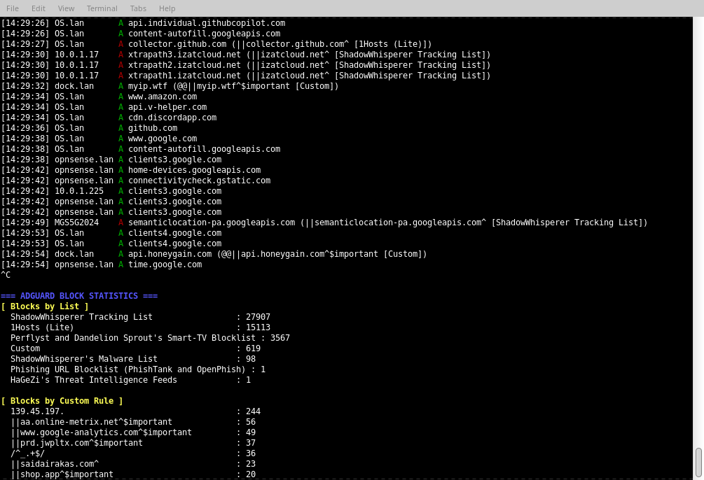

# scripts
random bash scripts

---
gps.sh: parses nmea sentences from a gps and displays it. I use this in opnsense. press enter or control+c to exit
```
GPS Info from /dev/cuaU0
Time: 22:55:53
Sats: 5   Fix: 1
Lat:  37° 4x.x97426"N
Lon: 122° 1x.x67381"W
Alt:   21.83M
[phv]dop:  1.75  1.45  0.99
```
---
adguardlive.sh: display a "live" log (updates once per second) from an adguard server. Takes an optional argument as a search filter term. Disregards HTTPS entries as I don't use it in my setup. Send control+c to view list and custom rules stats. Control+c twice within 1 second to exit. Script created with the help of a certain Google LLMඞ so use at your own risk.

